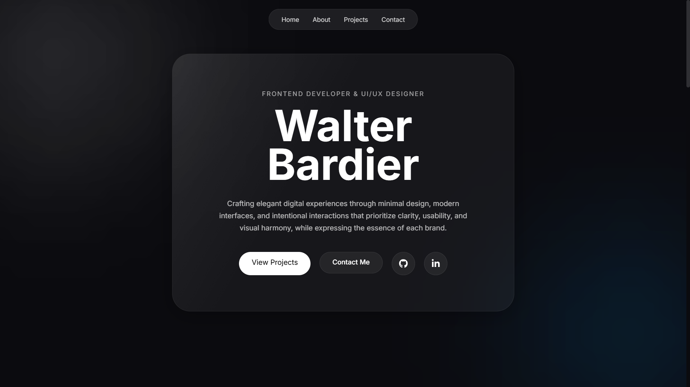
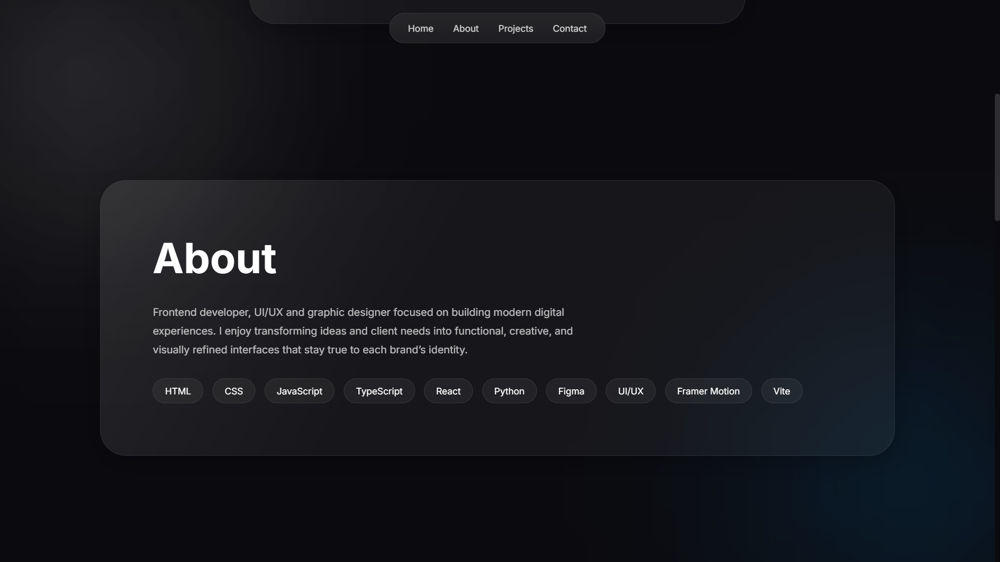
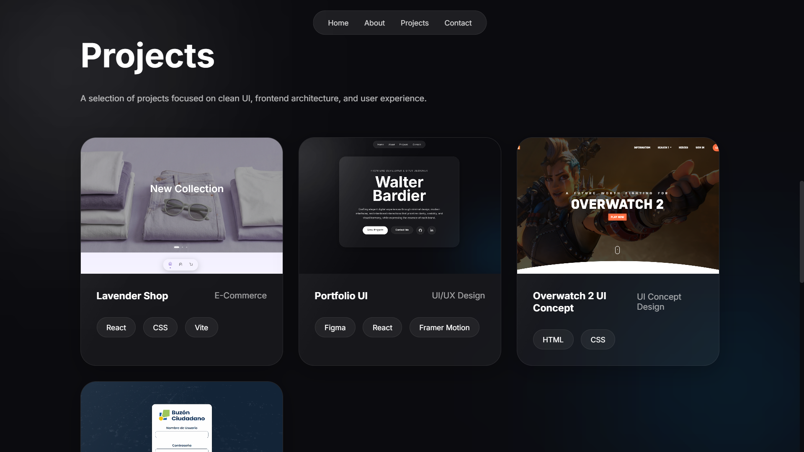
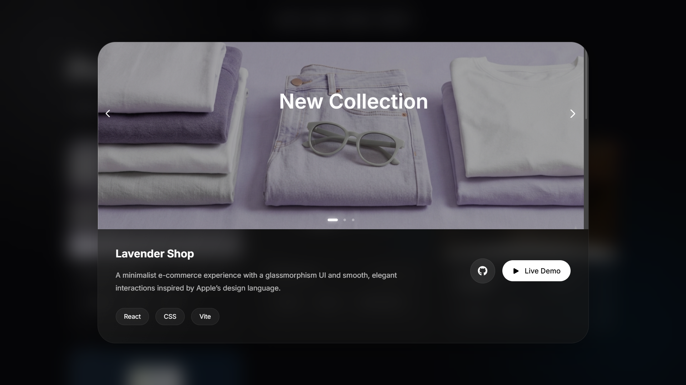
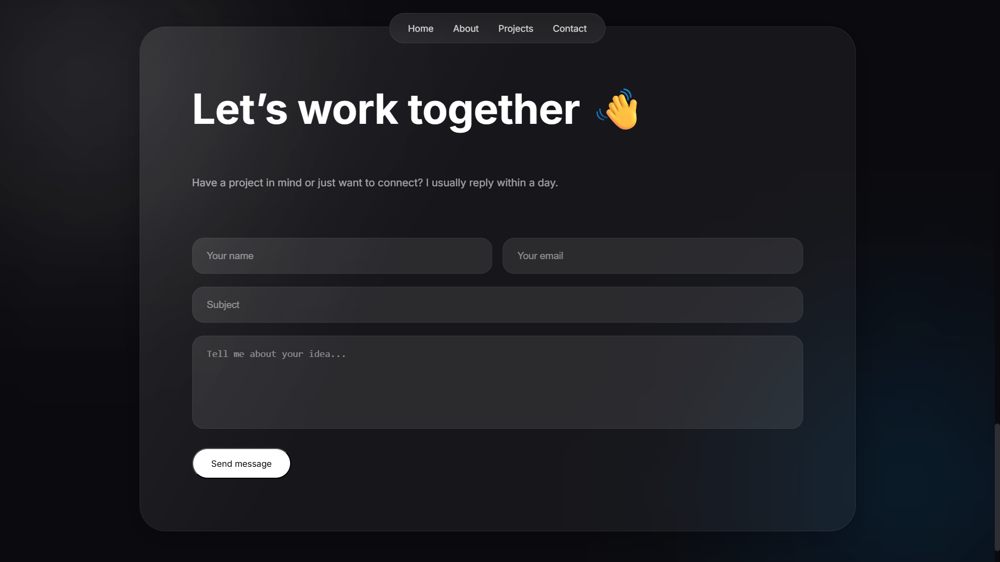

## 🌿 Portfolio UI

Portfolio UI is a modern personal portfolio website built with React, JavaScript, HTML, and CSS. It focuses on clean layouts, smooth interactions, and a minimal aesthetic inspired by contemporary UI/UX design systems.

The project was designed and developed as a practice to strengthen frontend development skills, component-based architecture, and UI/UX design implementation using React. It emphasizes visual clarity, motion design, and a refined user experience through subtle animations and responsive layouts.

The goal of this portfolio is not only to showcase projects but also to reflect the brand identity behind them — combining simplicity, elegance, and intentional design decisions that enhance usability and visual harmony.


## ✨ Features

- 🧑‍💻 Personal introduction section with animated hero layout
- 📁 Project showcase with modal-based detailed views
- 🎞️ Smooth transitions and micro-interactions (Framer Motion)
- 🖼️ Image carousel inside project modals
- 💫 Glassmorphism UI elements and modern visual effects
- 📱 Fully responsive design (mobile & desktop optimized)

## 🧰 Tech Stack

- React
- Framer Motion
- JavaScript (ES6+)
- HTML5
- CSS3 (custom, glassmorphism UI)

## ⚙️ Notes
- This project was bootstrapped with Vite.
- Designed as a personal branding and portfolio concept.
- Focused on UI/UX exploration rather than backend functionality.


## 🚀 Live Demo

👉 https://portfolio-walterbardier.vercel.app

## 📸 Screenshots

### General



### Projects



## Contact



## 📦 Installation

```bash
git clone https://github.com/walterbardier/portfolio.git
cd portfolio
npm install
npm run dev